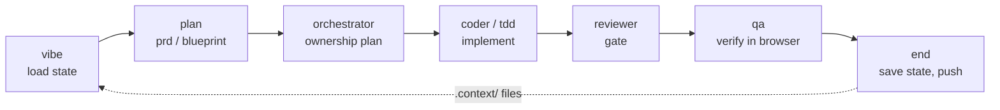

# A-Team

**A portable operating system for AI-assisted work.**

A-Team is a curated set of agent roles, slash commands, governance rules, and
state-file templates for turning ad hoc AI usage into repeatable workflows. It
grew out of daily practice running coding, research, and review agents across
multiple machines, and it answers the questions a single clever prompt cannot:

- What should the next session read first?
- Which agent owns planning, coding, review, or QA — and where do its rights end?
- What counts as done, and who gets to say so?
- How does work resume after a context reset, a model switch, or a machine change?

The answer, throughout, is the same: **put it in files an agent can read and
execute.** Chat context evaporates; the repository remembers.

## Quick tour

```text
.
├── AGENTS.md                  # Operating contract for AI agents working here
├── llms.txt                   # LLM-readable project summary
├── manifest.json              # Machine-readable inventory
├── .claude/
│   ├── commands/              # 19 workflow commands (session, planning, build, ops)
│   └── agents/                # 12 specialist role definitions
├── docs/
│   ├── quickstart.md          # Adopt one workflow in ten minutes
│   ├── reference.md           # Catalog of every command and agent
│   ├── architecture.md        # System model and data flow
│   └── evaluation.md          # How to judge a workflow system like this
├── governance/rules/          # Truth contract, scope ownership, public safety
├── templates/
│   ├── context/               # ORIENT / CURRENT / RESUME / DECISIONS state files
│   └── codex-brief.md         # Handoff brief for delegating implementation
├── examples/
│   └── session-walkthrough.md # One realistic day through the toolkit
└── scripts/                   # Minimal working helpers + contracts for the rest
```

## The core loop

Every session, regardless of task, follows the same shape:



The dotted edge is the point: `end` writes state files that the next `vibe`
reads, so a different day, model, or machine continues from written state
instead of from memory. `examples/session-walkthrough.md` shows a full day of
this loop on a small project.

## Core workflows

| Workflow | Files | Purpose |
| --- | --- | --- |
| Session start | `commands/vibe.md`, `commands/pickup.md` | Load state and choose the next action |
| Session close | `commands/end.md` | Save state, verify work, commit, push |
| Unattended run | `commands/zzz.md` | Continue long work with explicit resume points |
| Planning | `commands/prd.md`, `commands/blueprint.md`, `commands/plan-eng.md` | Idea to scoped, reviewable plan |
| Implementation | `commands/tdd.md`, `agents/coder.md`, `agents/orchestrator.md` | Test-first execution inside ownership lanes |
| Review | `commands/review.md`, `agents/reviewer.md`, `agents/adversarial.md` | Find regressions and risks before merge |
| QA | `commands/qa.md`, `agents/qa.md`, `agents/ui-inspector.md` | Structured product and visual checks |
| Operations | `commands/incident.md`, `commands/doc-sync.md`, `commands/mesh.md` | Diagnose failures, kill doc drift, audit the toolkit itself |

The full catalog with one-line descriptions of all 19 commands and 12 agents
is in `docs/reference.md`.

## Design principles

1. **Context is a first-class artifact.** Important state lives in
   `.context/` files (`templates/context/` has the four starters), not in
   chat memory.
2. **Roles are explicit.** Planner, executor, reviewer, and QA are different
   agents with different rights. Overlap is where drift starts.
3. **Completion is evidence-based.** Done means the declared checks passed —
   see `governance/rules/truth-contract.md`, the toolkit's rule zero.
4. **Scope is written before code.** Parallel agents get ownership lists, not
   good intentions — see `governance/rules/scope-ownership.md`.
5. **Handoff is cheap by design.** Any session's end state is enough for a
   different model or machine to resume.

## Language note

Top-level docs are in English. The command and agent files themselves are in
Korean — they are the working originals, exported as-is, and LLMs execute them
regardless of the reader's language. Treat that as a live demonstration of the
thesis: these files are programs whose runtime is a language model, and the
model is bilingual even if you aren't. `docs/reference.md` indexes every file
in English.

## Getting started

Ten-minute path in `docs/quickstart.md`. The shortest version:

1. Copy `.claude/commands/tdd.md` (or any one command) into your project.
2. Copy `templates/context/CURRENT.md` to `.context/CURRENT.md` and fill in
   three real tasks.
3. Open your coding agent and invoke the command. Adjust the file's done
   criteria to your stack as friction appears.

Adopt one workflow, live with it, then take a second. Nothing here requires
the whole system at once.

## Public export scope

This is the cleaned public edition of a private daily-driver toolkit. It
intentionally excludes private project state, personal logs, machine-specific
scripts, credentials, and employer-specific material — see
`governance/rules/public-safety.md` for the exact line. Where commands
reference private helper scripts, `scripts/README.md` documents their
contracts so you can reimplement or skip them.

## License

MIT
