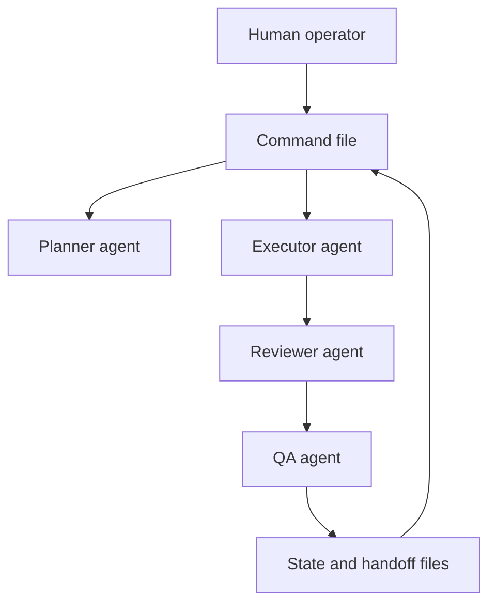

# Architecture

A-Team is a file-backed operating layer for AI agents.

## Layers

| Layer | Directory | Role |
| --- | --- | --- |
| Commands | `.claude/commands` | Repeatable procedures an operator can invoke |
| Agents | `.claude/agents` | Role prompts with clear responsibility boundaries |
| Governance | `governance/rules` | Constraints that keep work scoped and verifiable |
| Templates | `templates` | Handoff formats for delegating implementation |
| Metadata | `llms.txt`, `manifest.json` | AI-readable summary and inventory |

## Data Model

A workflow should define:

- input context
- owned files or scope
- step sequence
- required checks
- output format
- handoff notes for the next session

## Why File-Backed

Chat context disappears, compresses, or becomes ambiguous. Files remain visible
to the next agent. A-Team therefore treats workflow state, done criteria, and
role boundaries as repository artifacts.
